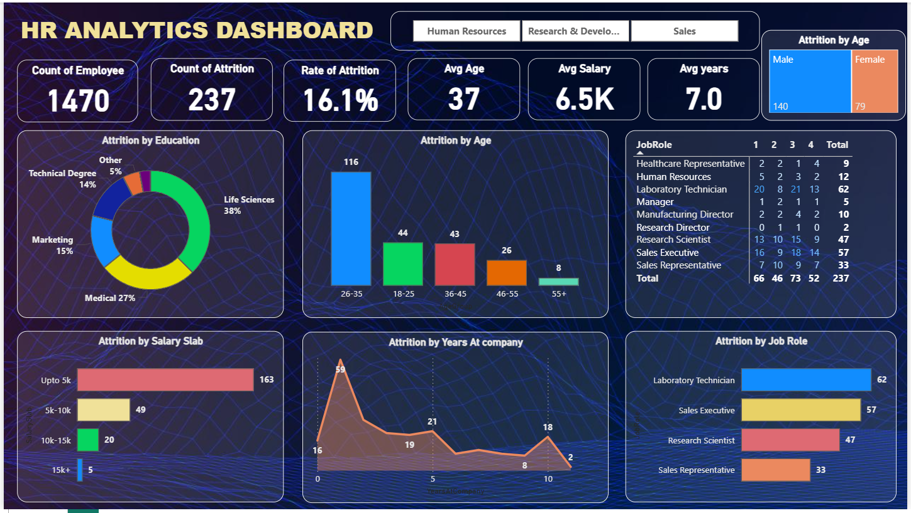

# 📊 HR Analytics Dashboard

This repository contains a Power BI project for HR Analytics. The dashboard is designed to provide key insights into an organization's human resources data, focusing on employee attrition. This tool helps HR managers and business leaders make data-driven decisions to improve employee retention and overall workforce management.

## 🚀 Key Features

* **Employee Attrition Analysis:** In-depth analysis of employee attrition by age, job role, education, and salary.
* **Interactive Visualizations:** Dynamic charts and graphs allow for easy exploration and understanding of the data.
* **Key HR Metrics:** Displays essential metrics such as the total number of employees, attrition count, and attrition rate.
* **Demographic Insights:** Breakdown of employee demographics by gender and age.

## 🖥️ Dashboard Screenshot

Here is a preview of the main dashboard page:

## 📂 Project Files

* `HR_Analytics_Dataset.csv`: The raw dataset used for this project.
* `PowerBI_Project.pbix`: The Power BI project file containing the data model, measures, and dashboard layouts.
* `Dashboard.png`: A screenshot of the completed dashboard.
* `Power_BI.png`: The Power BI logo used in the project.

## 📈 Dashboard Insights

The dashboard provides answers to key business questions, including:

* **Who is leaving the company?** By analyzing attrition across different demographics like age, job role, and salary, we can identify high-risk groups.
* **What are the key drivers of attrition?** The dashboard helps to visualize correlations between factors like education and years at the company with attrition rates.
* **What is the overall health of our workforce?** Metrics like average age and years at the company provide a quick snapshot of the employee base.

## Tool:** Microsoft Power BI

  

## 🛠️ Technical Details

* **Data Source:** `HR_Analytics_Dataset.csv`
* **Data Modeling:** The project utilizes a single flat table for simplicity.
* **DAX Measures:** Custom DAX measures were created to calculate key performance indicators (KPIs) like `Count of Attrition` and `Rate of Attrition`.

## 📌 How to View the Dashboard

To view and interact with the dashboard, you need to have **Microsoft Power BI Desktop** installed on your computer.

1.  Clone or download this repository to your local machine.
2.  Open the `PowerBI_Project.pbix` file using Power BI Desktop.
3.  The dashboard will load, and you can interact with all the slicers and visuals.

## 🤝 Contact
